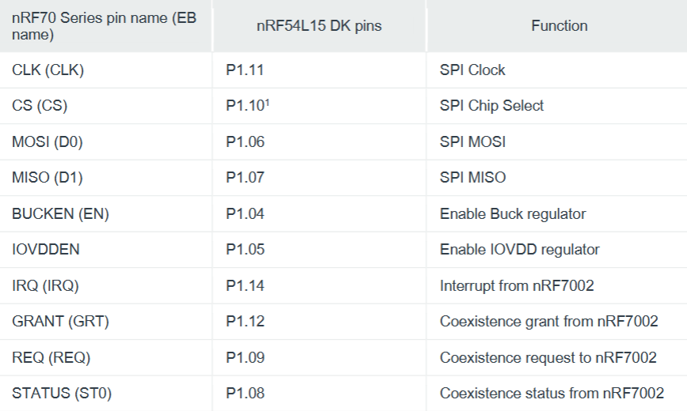

# EmbW_IoT
## Introduction
The goal of this project is to create a 802.15.4 network bridge over wifi using nrf54l15s. Two nRF54L15 boards on the same network can communicate with each other using the 802.15.4 protocol, while two boards on different networks must communicate via some other method, for example using wifi. In this project, we have four total boards: two sets of two, with each set connected to a different network. One board in each set is also connected to a daughter board to allow for wifi communication between them. The wifi-connected boards can send and recieve 802.15.4 packets to and from the other board on their networks. The wifi-connected boards can also wrap and unwrap 802.15.4 packets into and from IP packets, and send them to a server which both wifi boards are connected to. This allows packets to be sent to any of the four boards, and make it appear as though all boards are connected to the same network.

## Hardware Details
We use four nRF54L15 boards, and two nRF7002 daughter boards.
#### nRF54L15
* 128 MHz Arm Cortex-M33
* 1.5MB NVM and 256 KB RAM
* Ultra-low-power multiprotocol 2.4GHz Radio
* more details here: https://www.nordicsemi.com/Products/nRF54L15
#### nRF7002
* 2.5 GHz and 5 GHz dual band
* low power and secure Wi-Fi
* coexistence with Bluetooth LE
* more details here: https://www.nordicsemi.com/Products/nRF7002
#### Power
#### RF specs

## Software Environment
#### Firmware
* nRF Connect SDK Toolchain for VS Code v3.2.1
* Zephyr RTOS
* Build system and board configuration

## Reproducibility guide
* Wiring for Daughter Boards:

* note that on the nrf-7002 EK boards being used, the CS pin is labeled SS instead.
* make sure to also wire up V5V, GND, and VIO, too.

* Toolchain installation guide: https://docs.nordicsemi.com/bundle/ncs-latest/page/nrf/installation/install_ncs.html
#### For the wifi boards
* Open "network_attached_nrf" as an application.
* In "network_attached_nrf\prj.conf" set "CONFIG_BRIDGE_RELAY_HOST" to be the ip address of the server hosting the bridge.
* Build instructions:
  *   Set "Board Target" to nrf54l15dk\nrf54l15\cpuapp"
  *   Add an extra Cmake argument. The argument should be "-DSHIELD=nrf7002eb2"
  * Flash this application to both wifi boards
#### For the non-wifi boards (802.15.4 connection only)
* Open "802154_nrf" as an application
* In the build configuration, set "Board Target" to nrf54l15dk\nrf54l15\cpuapp"
* Flash this application to both non-wifi boards.
* set `src_extended_addr` and `dst_extended_addr`, for each of the non-wifi boards such that `src_extended_addr` is the same as `dst_extended_addr` for the other.
#### In both applications
* In both applications, there is a script called "radio_154.c"
* In prj.conf, set CONFIG_BRIDGE_15_4_CHANNEL for all the boards such that the two boards on the same network share a channel
 * That is, each wifi-802.15.4 pair shares a channel, but the two pairs should have different channels. 
* The boards that will be communicating over 802.15.4 must have the same channel
### Testing/Measurement
* Open up the VCOM recieving the data from the board (we did so in VSCode)
* For each board, there should be messages stating when the WiFi connection request was sent to the server, messages while it is scanning, and a message when it is connected to the bridge server.
* The output on the endpoint boards should look something like this
```
[00:00:00.014,363] <inf> send: radio entered rx state
[00:00:04.560,283] <inf> send: frame was transmitted!
received:sending data from nrf 1
```
